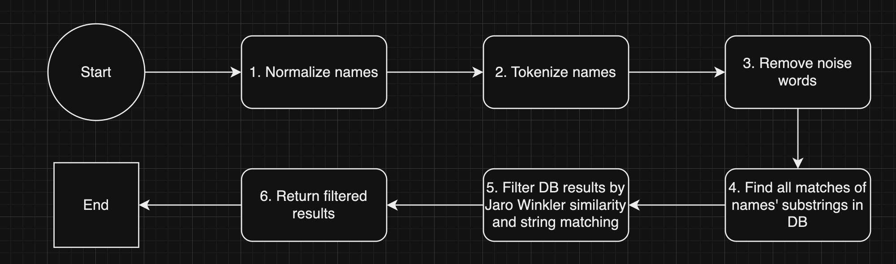

# LHV AML API v1
Service to validate if the person is sanctioned by EU banks

## Some info
I have modified the CSV file a bit (removed first row of the file), because it was composed in a way that
1st and 2nd rows are headers of columns, although the real headers are on the second row. 

## Required setup (at the moment of development)
JDK 17+

Gradle 8.3+

Docker 4.25.0+

Postgres 16 (postgres:latest in docker-compose.yml)

## Required ENV variables:

`POSTGRES_DB=lhv_aml`

`POSTGRES_DEFAULT_SCHEMA=public`

`POSTGRES_USERNAME=<your_db_username>`

`POSTGRES_PASSWORD=<your_db_password>`

# To run application locally

## 1. Set and export ENV variables (Linux/MacOS)
* `export $(xargs < .env)`

## 2. Start up DB and RabbitMQ containers
* `docker-compose up -d postgresdb`

## 3. To run the project with Gradle for `MacOS/Linux`:
Build the project 
(NB! Make sure that env variables are set and exported and DB is up and running as liquibase migrations are run on ./gradlew build, cold start takes up to 3min [CSV file import is about 17k+ rows]):
* `./gradlew clean build` 

Run tests:
* `./gradlew test`

## 5. And then...
Run the project:
* `./gradlew bootRun`

# API docs
* For LHV AML API docs go to `http://localhost:8009/docs/swagger-ui/index.html`

## What can be improved
* API docs (more detailed info about DTOs' fields)
* More tests (acceptance, unit, integration)
* Improved name matching logic

## Simplified flow diagram of name matching algorithm

### Some explanations
1. Normalize tokens - Convert all characters to lowercase and strip out any punctuation
2. Split the names into words/tokens - 'Edgar Selihov' -> ['edgar', 'selihov']
3. Filter out the noise words like "the", "to", "an", "mrs", "mr", "and" etc
4. Find all matches of names' substrings in DB - e.g (SELECT name_6 FROM sanctioned_person WHERE name_6 ILIKE '%name_token%' OR name_1 ILIKE '%name_token%') and so on..
5. Filter DB results by Jaro Winkler similarity and string matching:
   * Threshold for Jaro Winkler similarity is set to 0.85
   * String matching takes full name from DB (concatenated name fields [name_6, name_1, name_2, name_3, name_4, name_5]) and name tokens are one by one is checked if full name contains it. String matching threshold is set to 0.75 (75%).
   * Both thresholds are configurable in application.yml file
6. Filtered results are returned
